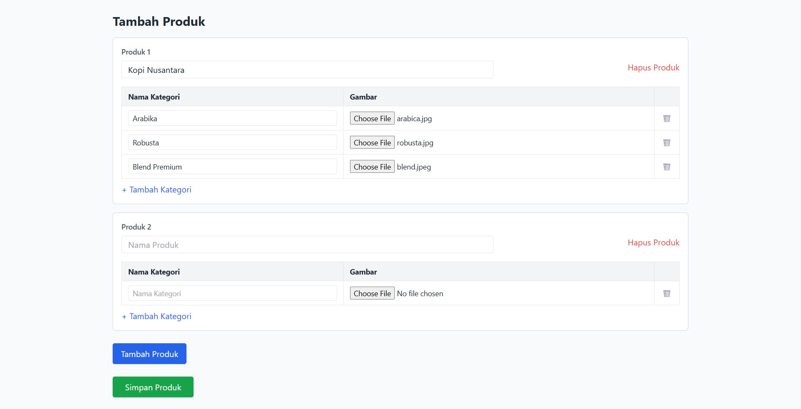
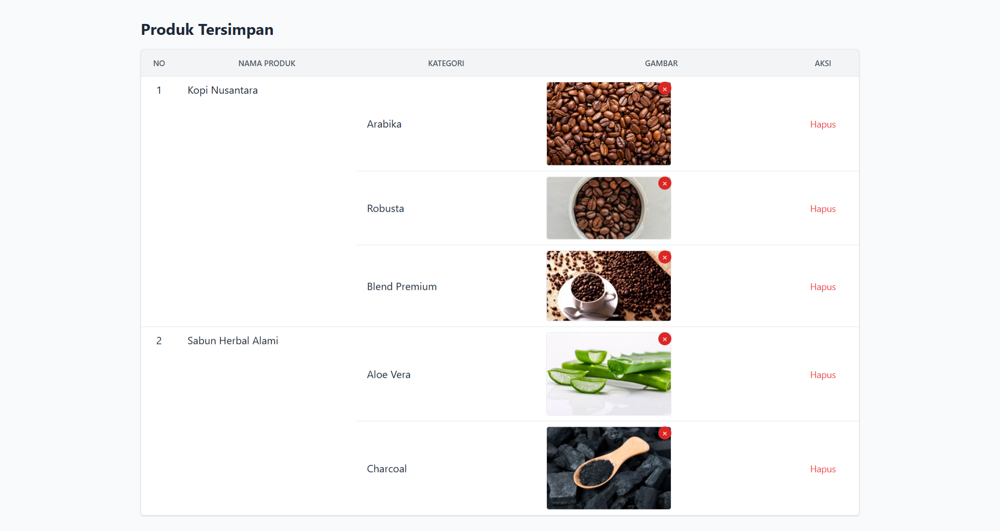

# Product Description Module – Stafbook Assessment

This project is a web-based form that allows users to dynamically add and manage product information for **Green Mart**.

Developed by Abdul Majid Refindo

---

## Screenshot Preview

### Tambah Produk


### Produk Tersimpan


---

## Features

### Product List

* Add up to **5 products**
* Each product includes:

  * Product name
  * Dynamic categories list
  * Delete option
* Shows a message and hides add button when max is reached

### Category per Product

* Add up to **3 categories** per product
* Each category includes:

  * Category name
  * Image attachment (JPG, JPEG, PNG only)
  * Delete category row
* Shows a warning and disables add button when max is reached

### Image Uploads

* Upload image per category
* Preview uploaded image
* Remove uploaded image with confirmation modal:

  * “Hapus” button in red (`#D22B2B`)
  * “Batalkan” button in grey (`#808080`)

### Saved Products Table

* Products and their categories are displayed in a clean table
* Responsive layout using **TailwindCSS**
* Each category row includes:

  * Product name (rowspan for multiple categories)
  * Category name
  * Uploaded image (or “No image” text)
  * Delete buttons

---

## Tech Stack

* HTML, JavaScript (jQuery)
* Laravel Blade Templates
* TailwindCSS
* AJAX for saving & deleting data dynamically

---

## Getting Started

### 1. Clone the Repository

```bash
git clone https://github.com/abdulmajidrefindo/product-description.git
cd product-description
```

### 2. Install Dependencies

```bash
composer install
```

### 3. Setup Environment Variables

Copy `.env.example` to `.env` and configure the environment:

```bash
cp .env.example .env
```

Edit `.env` and set up your database credentials:

```env
DB_CONNECTION=mysql
DB_HOST=127.0.0.1
DB_PORT=3306
DB_DATABASE=product-description
DB_USERNAME=root
DB_PASSWORD=
```

> Make sure the database `product-description` already exists.

### 4. Generate Application Key

```bash
php artisan key:generate
```

### 5. Migrate Database

```bash
php artisan migrate
```

> If you need to reset and reapply migrations:

```bash
php artisan migrate:fresh
```

---

## Running the App

### Development

```bash
php artisan serve
```

The application will be accessible at:

```
http://127.0.0.1:8000
```
